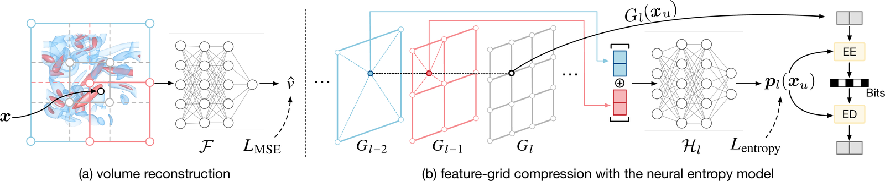

# MAGIC: Multi-Level Rate-Aware Grid-Based Implicit Neural Compression for Volume Visualization

MAGIC represents a volume data with a multi-level dense feature grid and a lightweight decoder, and compresses the grid with the neural entropy model in order to simultaniously achieve high compression ratio, accurate reconstruction, and fast random access that can benefit the rendering process.



---

## Directory Layout

```
.
├── train.py                 # compress: fit the INR + entropy model, write the bitstream
├── decompress.py            # decompress: rebuild the volume, report CR and PSNR
├── renderer.py              # direct volume renderer: renders the INR itself, no decode to disk
├── inr_loader.py            # decodes a bitstream into a renderable model
├── render_state.py          # camera / transfer-function presets
├── magnetic_state.json      # the preset used for the magnetic figure in the paper
├── compressor/
│   ├── config.py            # fixed configuration (see "Fixed Configuration")
│   ├── utils.py             # volume I/O, coordinate grids, full-volume PSNR
│   ├── backbones/           # multi-level feature grid + decoder MLP
│   └── entropy/             # cross-level entropy model + arithmetic codec
├── data/
│   └── magnetic_reconnection_512x512x512_float32.nc   # bundled example volume, 512 MB
├── example_run/             # a pre-compressed bitstream, for the quick test
│   ├── features.b           # entropy-coded feature grid, 134.7 KB
│   ├── rest.pt              # decoder + entropy-model weights, 31.9 KB
│   └── metadata.json
├── assets/
└── requirements.txt
```

## Installation

Clone this repository with Git LFS installed to download the bundled example volume:

```bash
git lfs install
git clone https://github.com/PVIS2027-5505/MAGIC.git
cd MAGIC
git lfs pull
```

```bash
pip install torch --index-url https://download.pytorch.org/whl/cu121   # any recent build
pip install -r requirements.txt
```

`torchac` builds a small CUDA extension on first import, which takes a minute and needs a CUDA toolkit matching the PyTorch build. `nerfacc` and `imageio` are needed only by `renderer.py`. Developed with Python 3.10, PyTorch 2.12 and CUDA 13.0; any CUDA GPU with room for the feature grid works.

## Dataset

The **magnetic reconnection** volume used throughout this README ships in `data/`: `512 x 512 x 512` float32 NetCDF, 512 MB. Nothing else needs to be downloaded.

The other volumes in the paper come from public repositories and are not redistributed here.

## Data Format

| format | how the shape is determined |
| --- | --- |
| `.nc` | read with `netCDF4`; the first variable in the file is used |
| `.raw` | parsed from the filename, which must contain `XxYxZ` (e.g. `name_600x248x248_float32.raw`). Little-endian float32 in `z,y,x` order, so the array is reshaped with the filename's dimensions reversed. |

Every volume is linearly rescaled to `[-1, 1]` on load. The mapping is monotonic so it leaves PSNR unchanged, but it conditions the optimisation for data with a large dynamic range.

## Quick Test

Decompress the bundled bitstream and score it against the original volume:

```bash
python decompress.py --save_dir example_run \
  --data data/magnetic_reconnection_512x512x512_float32.nc
```

```
[decompress] gt=data/magnetic_reconnection_512x512x512_float32.nc shape=(512, 512, 512) raw_size=512.0 MB
[decompress] loaded state_dict (missing=5)
  features.b=134.7 KB  CR(features-only)=3891.8x  PSNR=46.120 dB
```

166.6 KB of bitstream (134.7 KB features + 31.9 KB weights) stands in for a 512 MB volume. This is the magnetic row of the paper's comparison against conventional compressors, which reports 3,139x at 46.06 dB -- where SZ3, TTHRESH and ZFP reach 868x, 1,516x and 403x at the same quality. Decoding takes a few seconds and involves no training, so the number above is exact.

## Compression

```bash
python train.py --data data/magnetic_reconnection_512x512x512_float32.nc \
  --save_dir my_run --entropy_lambda 0.005
```

That is the command behind `example_run/`. It writes `features.b`, `rest.pt` and `metadata.json` into `--save_dir` and prints the compression ratio and PSNR when it finishes.

| flag | default | meaning |
| --- | --- | --- |
| `--data` | *required* | input volume (`.nc` or `.raw`) |
| `--save_dir` | *required* | output directory for the bitstream |
| `--entropy_lambda` | `0.03` | rate-distortion trade-off. **The only knob that moves the operating point** -- larger means a smaller file and lower PSNR. `0.005` is the value used for the bundled volume. |
| `--feature_grid_shape` | `16,32,64,128,256` | per-level grid resolutions, coarse to fine |
| `--n_features_per_level` | `16,8,8,4,4` | per-level channel counts, aligned with the resolutions |
| `--iterations` | `20000` | training steps |
| `--lr` | `1e-2` | initial learning rate, cosine-annealed |
| `--points_per_iteration` | `65536` | voxels sampled per step |
| `--log_every` | `2000` | training-loss print interval |
| `--device` | `cuda:0` | |

Sweeping `--entropy_lambda` traces the rate-distortion curve. On the bundled volume with the default grid:

| `--entropy_lambda` | CR | PSNR (dB) |
| ---: | ---: | ---: |
| 0.001 | 1,443 | 48.36 |
| 0.003 | 2,630 | 46.63 |
| **0.005** | **3,148** | **46.12** |
| 0.01 | 4,621 | 45.05 |
| 0.02 | 7,821 | 43.41 |

## Decompression

```bash
python decompress.py --save_dir my_run \
  --data data/magnetic_reconnection_512x512x512_float32.nc
```

`--data` supplies the ground truth for PSNR only; decoding itself needs nothing but `--save_dir`. The model configuration is recovered from buffers inside `rest.pt`, so the bitstream is self-describing. Results are written to `decompress_eval.json`.

## Rendering

`renderer.py` is a direct volume renderer built on `nerfacc`. It queries the INR at the sample points along each ray, so no need to reconstruct the volume first before rendering.

```bash
# render the compressed representation, using the paper's camera and transfer function
python renderer.py --save_dir example_run --state magnetic_state.json \
  --tf_range=0,1 --hw 1024,1024 --img_name magic.png

# the ground-truth volume, same camera and transfer function
python renderer.py --raw_data --data data/magnetic_reconnection_512x512x512_float32.nc \
  --state magnetic_state.json --tf_range=0,1 --hw 1024,1024 --img_name gt.png
```


An orbit renders a turntable sequence, one PNG per view under `renders/views/`:

```bash
python renderer.py --save_dir example_run --state magnetic_state.json \
  --tf_range=0,1 --hw 1024,1024 --orbit_views 180 --orbit_center volume \
  --img_name magic.png
```

| flag | meaning |
| --- | --- |
| `--save_dir` / `--raw_data --data` | render a compressed model, or a volume file |
| `--state` | camera + transfer function + shading preset (JSON) |
| `--tf_range=lo,hi` | domain the transfer function is stretched over. **Give the volume's own range** -- `0,1` for the bundled volume. Note the `=`, or a negative `lo` is eaten as a flag. |
| `--hw H,W`, `--spp` | resolution and samples per ray |
| `--orbit_views N` | render N views around the volume instead of one |
| `--orbit_center` | orbit pivot: `state` (the preset's centre of interest), `volume` (the volume's centre), or `x,y,z` |
| `--shading`, `--ambient`, `--diffuse`, `--specular` | override the preset's lighting |
| `--img_name` | output filename under `renders/` |
